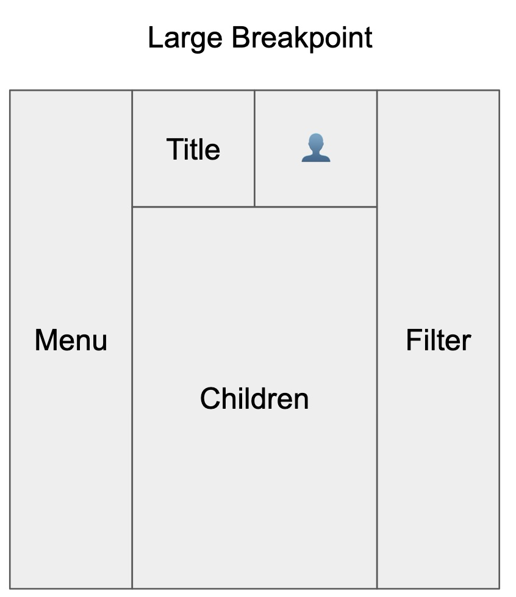
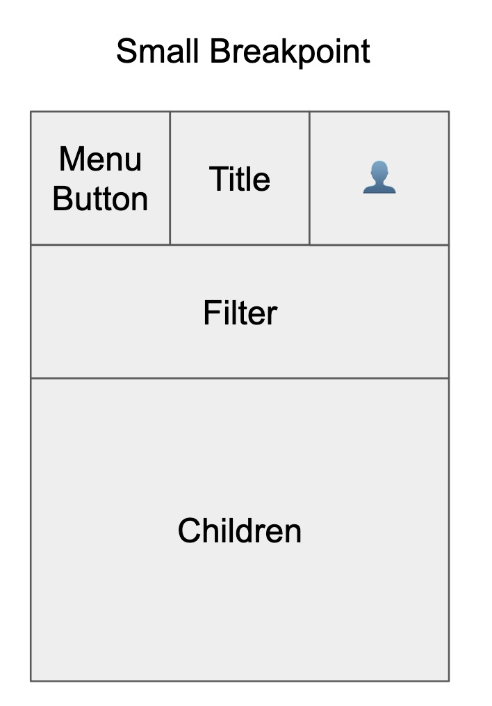

> This blog is targeted at javascript developers with experience using React, but many of the design-system concepts should be applicable across any User Interface (UI). 

The goal of this blog is to talk about:
  1. [What helped me get up to speed with implementing page layouts in css.]()
  2. [How we used object key syntax to implement a theme with by styled-components and styled-system.]()
  3. [Implementing responsive layouts using a window resize listener and the theme's breakpoint definitions.]()
  
  

# What helped me get up to speed with implementing page layouts in css.
April 2018 I began my work at [Oqton](https://www.oqton.com/) as a front-end engineer. Like many engineers working at startups, I came onboard with the understanding that my job would involve writing code, but the specifics would change as the company’s goals evolved. Before working at Oqton, my experience with css was very minimal. I generally felt okay modifying existing css, but I would hesitate if you were to ask me to implement any large feature to match a design specification.  
At some point during the first week, I noticed a bug in the UI that was only happening on Firefox. I did a bit of googling, wrote a few lines of css, and was very proud of myself when I was able to make a PR that addressed the issue. As the app evolved, our UI-Lead (who had been doing most of the css to this point) had assigned me a few more css-related tickets. I was frustrated by how long it took me to implement designs that, on first-glance, I considered “so simple”.

## Enter: FLEXBOX-ZOMBIES
While googling furiously to find the solution to a css-problem I was stuck on, I came upon the site [Flexbox-Zombies](https://mastery.games/p/flexbox-zombies). They didn’t have an immediate solution to my problem, but they did completely change the way that I approach css. This site offers an amazing (free) course that teaches you step-by-step how to use flexbox. I can’t say this enough:  

**Flexbox-Zombies has been one of the most useful learning resources in my career and I recommend it to anyone who uses css.** 

After completing the flexbox-zombies course, I became more confident in fixing css and even implementing new features.

Our UI-Lead had mentioned that we were potentially looking to hire another UI engineer. He had mentioned that the candidate would either be focusing on business-logic or design-system implementation. By this time I had cut my teeth on a few more css-related tickets. I wondered if I had the skills necessary to implement the styling for our app. I offered that I would be interested in taking ownership of our style implementation and beginning the work in making an official design system for our UI team.  

# How we used object key syntax to implement a theme with by styled-components and styled-system.

We utilize:
- [Styled Components](https://www.styled-components.com/) library to write CSS-in-JS for our app’s components 
- [Styled System](https://styled-system.com/) library for creating easy-to-use props for consuming your themed components. 
- [Rebass](https://rebassjs.org/) (v2) for styling all of our React components. 

^^ Rebass is a great library and I would highly recommend it as a starting point for any design system. **One downside is that Rebass's standard configuration requires that you use array syntax for your font-sizes, spacing, and breakpoint props.**

## Object key syntax for font-sizes, spacing, and breakpoints
Most boilerplate [Styled System](https://styled-system.com/) examples utilize array syntax like this
```js
const theme = {
  space: [
    0,
    8,
    16
   ],
};
```
The problem for our team was that the design-spec was in flux and we wanted to make sure if an additional space, fontSize or breakpoint was necessary, it could be added without having to overwrite all existing style declarations.

For example, if we had a `<Box />` component that used the styled-system space-prop for padding:
```jsx
<Box pt={0} />
<Box pt={1} />
<Box pt={2} />
```
But later on we wanted to add a spacing value of 4, for some reason.
```js
const theme = {
  space: [
    0,
    4,
    8,
    16
   ],
};
```
We would have to rewrite every instance of the `<Box />` component to
```jsx
<Box pt={0} />
<Box pt={2} />
<Box pt={3} />
```

By using key-based spacing, we are able to add additional values (relatively) painlessly
```js
const theme = {
  space: {
    none: 0,
    s: 8,
    m: 16
   },
};
```
And then consuming our theme will look like this:
```jsx
<Box pt="none" />
<Box pt="s" />
<Box pt="m" />
```

If after the fact we want to add a spacing value of `{ xs: 4 }` we can do so without having to rewrite any existing style declarations.

This same pattern can be applied with any styled-system helper function

# Implementing responsive layouts using a window resize listener and the theme's breakpoint definitions.

StyledSystem allows for modifying space props based on the current breakpoint. For example with key-based breakpoints for the theme
```js
const theme = {
  space: {
    none: 0,
    xs: 4,
    s: 8,
    m: 16
   },
  breakpoints: {
    s: 0,
    m: 400,
    l: 800,
    xl: 1200,
  }
};
```

You can use breakpoint keys to set per-breakpoint padding
```jsx
<Box
  pt={{
    s: 'xs',
    m: 's',
    l: 's',
    xl: 'm'
  }}
/>
```
Note, since breakpoints set a `min-width` media query, iit's not necessary to set multiple breakpoint values. For example the above code snippet can be condensed to this:
```jsx
<Box
  pt={{
    s: 'xs',
    m: 's',
    xl: 'm'
  }}
/>
```

## Using key-based breakpoints to render responsive layouts
Managing multiple responsive components in the context of a layout can become a bit messy. 
Imagine a layout that behaves like this:  

| Large Breakpoint      |  Small Breakpoint |
|--------------------------|-----------------------|
|||

Instead of using media queries and per-breakpoint style declaration, in many cases it was easier to create a per-breakpoint layout. We set event listeners onResize and then determine the `responsiveKey` from that.
For example: 
```jsx
const theme = {
  breakpoints: {
    s: 0,
    l: 800,
  }
};

function ourLayout({ menu, title, userIcon, filter, children }) {
  const [responsiveKey, setResponsiveKey] = useState(getCurrentResponsiveKey());

  function getCurrentResponsiveKey() {
    // Fall-back to the smallest breakpoint if nothing else matches
    let currentResponsiveKey = Object.values(theme.breakpoints)[0];

    for(const [key, value] of Object.entries(theme.breakpoints) {
      if (window.innerWidth >= value) {
        currentResponsiveKey = key;
      }
    }
    return responsiveKey
  }

  function setCurrentResponsiveKey() {
    setResponsiveKey(getCurrentResponsiveKey());
  }

  // componentDidMount
  useEffect(() => {
    window.addEventListener('resize', setCurrentResponsiveKey);
    // componentWillUnmount
    return () => {
      window.removeEventListener('resize', setCurrentResponsiveKey);
    }
  }, []);

  if(responsiveKey === 's') {
    return; // Imeplement small layout here
  } else if (responsiveKey === 'l') {
    return; // Implement large layout here
  }
}
```

That's a brief look into some ideas we've been exploring when implementing our design system.
- If you're interested in learning more, let me know 🐦 [@matt_hova](https://twitter.com/Matt_Hova) 🐦
- If there's a typo, or something that needs clarification, please [open an issue](https://github.com/matthova/design-systems-blog/issues) :)
- If you're interested in joining a company that's revolutionizing manufacturing, check out [Oqton](https://www.oqton.com/)
- If you haven't clicked on the [Flexbox Zombies](https://mastery.games/p/flexbox-zombies) link, do it now! It's amazing.

Thanks for reading
